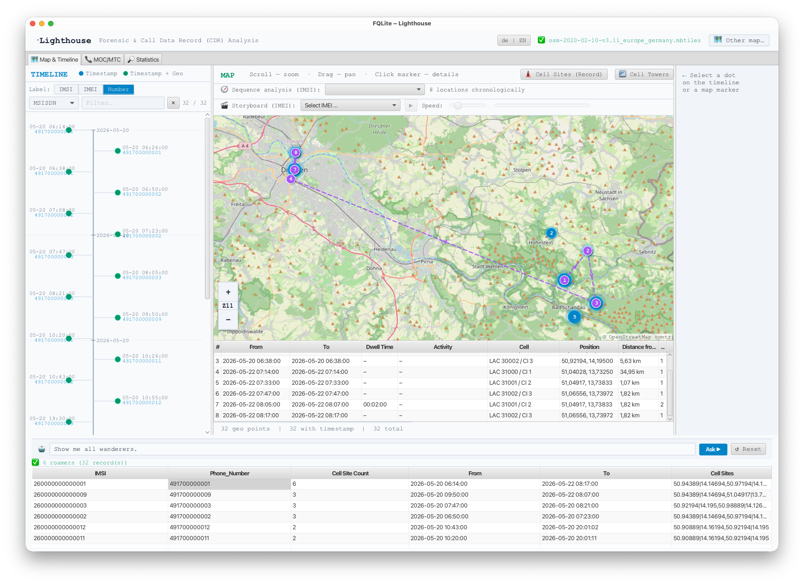
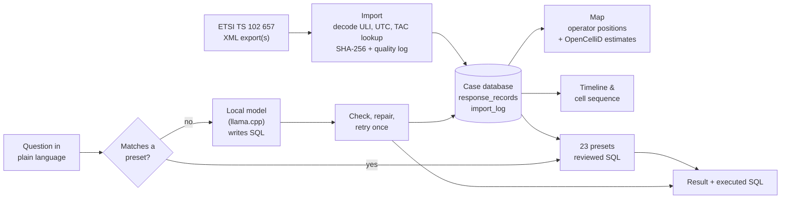

# Lighthouse

**Cell site and call detail record (CDR) analysis for ETSI TS 102 657 exports: a plugin for [FQLite](https://github.com/pawlaszczyk/fqlite).**

Lighthouse imports ETSI-compliant retained-data exports into a queryable database, shows the serving cells of calls, SMS and data sessions on a map and on a timeline, offers 23 fixed, reviewed analyses for recurring investigative questions, and answers questions in plain language with a small text-to-SQL model that runs **locally**, so no case data leave the examiner's machine.

  
   Timeline, map with the cell sequence of one IMSI, and the query assistant (here routed to the roamer preset). Synthetic test case from <code>data/synthetic-case</code>; dashed lines connect consecutive serving cells, not a route.

> [!IMPORTANT]
> **This repository presents Lighthouse. It does not contain its source code.**
> Lighthouse is developed and shipped as part of FQLite. The code lives in the FQLite repository:
> [`src/fqlite/importer`](https://github.com/pawlaszczyk/fqlite/tree/master/src/fqlite/importer) (ETSI import),
> [`src/fqlite/timemap`](https://github.com/pawlaszczyk/fqlite/tree/master/src/fqlite/timemap) (map, timeline, presets),
> [`src/fqlite/rag`](https://github.com/pawlaszczyk/fqlite/tree/master/src/fqlite/rag) (query assistant).
> Please report bugs and feature requests in the [FQLite issue tracker](https://github.com/pawlaszczyk/fqlite/issues).
>
> What you find here: documentation, the synthetic test case, the training and test data of the query assistant, and links to the model.

## Download

Lighthouse is installed together with FQLite; there is no separate installer. The table below is updated automatically whenever a new FQLite release appears.

<!-- LATEST-RELEASE:START -->
**Latest FQLite release: [5.0](https://github.com/pawlaszczyk/fqlite/releases/tag/5.0)** (published 2026-10-01)

| Platform | File | Size |
|---|---|---|
| macOS (Apple Silicon) | [fqlite-5.0-macOS-arm64.dmg](https://github.com/pawlaszczyk/fqlite/releases/download/5.0/fqlite-5.0-macOS-arm64.dmg) | 424.4 MB |
| macOS (Intel) | [fqlite-5.0-macOS-x86_64.dmg](https://github.com/pawlaszczyk/fqlite/releases/download/5.0/fqlite-5.0-macOS-x86_64.dmg) | 428.2 MB |
| Windows | [fqlite-5.0-windows.exe](https://github.com/pawlaszczyk/fqlite/releases/download/5.0/fqlite-5.0-windows.exe) | 421.8 MB |
| Linux (Debian/Ubuntu, .deb) | [fqlite-5.0-x86_64.deb](https://github.com/pawlaszczyk/fqlite/releases/download/5.0/fqlite-5.0-x86_64.deb) | 426.7 MB |

All releases and release notes: <https://github.com/pawlaszczyk/fqlite/releases>
<!-- LATEST-RELEASE:END -->

## What Lighthouse does

| | |
|---|---|
| **Import** | Reads one or more ETSI TS 102 657 `RetainedData` XML files (telephony, SMS, GPRS/data) into one SQLite database. Decodes the GTPv1 user location information (MCC/MNC, area and cell identity), converts operator-reported coordinates, normalises all timestamps to UTC and resolves handset make and model from the IMEI's type allocation code. |
| **Chain of custody** | Every imported file is recorded with its SHA-256 hash (before and after the import), record counts, importer version and a data-quality log (malformed timestamps or coordinates, duplicate record numbers). The XML parser rejects external entities. |
| **Map** | Serving cells on an OpenStreetMap map, from a local `.mbtiles` file (works offline) or online tiles. Operator-reported cell positions and crowdsourced estimates are shown as **separate layers**; cells with an azimuth are drawn as a direction wedge. |
| **Timeline and sequence** | Chronological cell sequence of an IMSI with the distance between consecutive cells, a storyboard per IMEI, and a timeline of all activity. Filters by cell, LAC or cell ID; views can be reset to try another hypothesis. |
| **23 analysis presets** | One-click analyses such as roamers, recurring pairs, device/SIM swaps (*Wechsler*), cross-source hits, domestic/foreign numbers, call and SMS partners, and frequent companions. Each is a single, hand-reviewed SQL query, so the result is deterministic and the query can be disclosed. [Full list](docs/presets.md). |
| **Query assistant** | Questions in German or English, such as *"Which IMSI belongs to number 4917…?"* or *"Show all roamers on 15 September between 1:00 and 11:00"*. A local 3-billion-parameter model writes the SQL; the query is checked and repaired where possible, and results that cannot be drawn on the map open in a result window together with the executed SQL. [How it works](docs/query-assistant.md). |
| **Usability** | German/English interface (switchable at runtime), copy selected cells to the clipboard, status reporting on how many cells were resolved and how. |

## How it works

## What the map does and does not show

**Lighthouse does not determine where a device was.** It shows which cell served a device at the time of a record. The device can have been anywhere in that cell's coverage area, which is itself not known from the CDR.

Cell positions come from two sources that Lighthouse keeps apart:

- **Operator-reported coordinates and azimuth**, where the export contains them (evidence-derived).
- **OpenCelliD**, a crowdsourced database, looked up locally in up to five labelled levels (exact cell, base-station centroid, nearest known cell, optionally beaconDB). These are estimates for orientation and for forming hypotheses. They are never written into the case database.

For an opinion on a device's location, use the operator's cell database and, where needed, radio-frequency surveys. Details: [Cell reference data and their limits](docs/cell-reference-data.md).

## Privacy

The language model runs on the examiner's computer via [llama.cpp](https://github.com/ggml-org/llama.cpp) and sends nothing to an AI service. Three optional lookups use the internet only if you enable them, and none of them transmits subscriber identifiers:

| Optional online service | What is sent |
|---|---|
| Map tiles (fallback if no local `.mbtiles` file is configured) | Map tile coordinates |
| [beaconDB](https://beacondb.net) (cells missing from the local OpenCelliD copy) | Cell identity (MCC, MNC, area, cell ID) |
| Device lookup by type allocation code | First 8 digits of the IMEI (identifies a model, not a device) |

## Getting started

1. Install the latest FQLite release (see [Download](#download)).
2. Open an ETSI XML export with **File → Open Database…** or drag it onto the window. Several files can be selected at once; they are merged into one database next to the first file, and each row keeps its `source_file`.
3. Select the table `response_records` and click the **Lighthouse** button in the toolbar.
4. Optional: configure a local map (`.mbtiles`), an OpenCelliD export and the language model under **Settings**.

Step-by-step instructions, including the model download and building from source: [docs/getting-started.md](docs/getting-started.md). To try Lighthouse without real data, use the [synthetic test case](data/synthetic-case).

## Model and data

| | Where |
|---|---|
| Lighthouse query model (Llama 3.2 3B, fine-tuned for the ETSI schema, GGUF Q8_0 3.4 GB / Q4_K_M 2.0 GB) | Hugging Face: [`pawlaszc/Lighthouse-ETSI-CDR-Text2SQL`](https://huggingface.co/pawlaszc/Lighthouse-ETSI-CDR-Text2SQL) |
| General forensic SQLite text-to-SQL model (stage 1, basis of the above) | Hugging Face: [`pawlaszc/DigitalForensicsText2SQLite`](https://huggingface.co/pawlaszc/DigitalForensicsText2SQLite) |
| Stage-1 training data | Hugging Face: [`pawlaszc/mobile-forensics-sql`](https://huggingface.co/datasets/pawlaszc/mobile-forensics-sql) |
| Synthetic ETSI case (two exports, imported database) | [`data/synthetic-case`](data/synthetic-case) |
| Training data of the query model | [`data/training`](data/training) |
| Frozen test sets with SHA-256 manifests | [`data/test-sets`](data/test-sets) |

All data in this repository are synthetic. No real case data are included.

## Evaluation

The import and the query assistant are evaluated in the accompanying article (see [Citation](#citation)): field-by-field validation of the import, robustness against malformed input, and the query assistant compared with untrained local models and a large cloud-hosted model, with an error analysis.

In short: the import is reliable, and after corrections it is robust against malformed input. The assistant clearly beats untrained local models of the same size. It falls behind a large cloud model that is given a few examples, and most of its remaining errors look plausible rather than obviously wrong. After targeted retraining on basic questions, the current model (V4) answers 87.5 % of the instances of an independent test set of basic questions correctly, without a measurable change on the harder test sets. **Always check an answer against the displayed SQL and the underlying records**, and use the presets for recurring questions where reproducibility matters.

## Citation

If you use Lighthouse, please cite the article (details will be added on publication) and FQLite. [`CITATION.cff`](CITATION.cff) provides the metadata; GitHub shows it under *Cite this repository*.

> D. Pawlaszczyk, D. Labudde, C. Hummert, R. Bodach, P. Engler, J. Kolouch, M. Spranger: *AI-Assisted Cell Site Analysis: An Open Source Solution for Forensic Investigation of Call Detail Records.* Submitted to Science & Justice.

## License

- Lighthouse and FQLite source code: [Apache License 2.0](https://github.com/pawlaszczyk/fqlite/blob/master/LICENSE) (in the FQLite repository).
- Documentation and scripts in this repository: [Apache License 2.0](LICENSE).
- Data in [`data/`](data): [CC BY 4.0](data/LICENSE).
- Map data © OpenStreetMap contributors. Cell data © OpenCelliD contributors (CC BY-SA 4.0); not redistributed here.

## Contact

Dirk Pawlaszczyk, Faculty of Computer Sciences, Hochschule Mittweida, Germany. [pawlaszc@hs-mittweida.de](mailto:pawlaszc@hs-mittweida.de)
